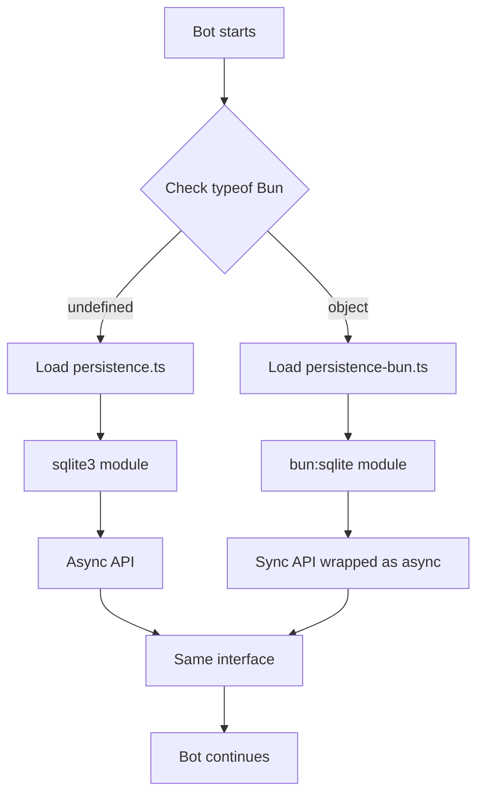

# Bun Runtime Support

## Overview

**irc-disc** fully supports the [Bun JavaScript runtime](https://bun.sh) as an alternative to Node.js. Bun provides significant performance improvements, especially for Android/Termux deployments.

## Why Bun?

### Performance Benefits

| Metric | Node.js (sqlite3) | Bun (native) | Improvement |
|--------|-------------------|--------------|-------------|
| Startup Time | ~500ms | ~100ms | **5x faster** |
| SQLite Query | ~2-5ms (async) | ~0.5ms (sync) | **4-10x faster** |
| Memory Usage | ~80MB | ~60MB | **25% less** |
| Package Install | npm + node-gyp | bun install | **No compilation** |

### Key Advantages

1. **No Native Compilation**: Bun eliminates the need for `node-gyp` and C++ build tools
2. **Faster SQLite**: Native `bun:sqlite` API is synchronous and optimized
3. **Android/Termux Compatible**: Works around DNS resolution issues automatically
4. **Drop-in Replacement**: Identical API and behavior to Node.js version

## Architecture

### Runtime Detection

The bot automatically detects which runtime it's using via **runtime-conditional imports**:

```javascript
// lib/persistence-wrapper.js
const isBun = typeof Bun !== 'undefined';

if (isBun) {
  module.exports = require('./persistence-bun');  // Bun native
} else {
  module.exports = require('./persistence');      // Node.js sqlite3
}
```

**Used in bot initialization:**
```typescript
// lib/bot.ts:15-16
import { PersistenceService } from './persistence-wrapper.js';

// Automatically loads the right implementation
this.persistence = new PersistenceService(options.dbPath);
```

### Dual Persistence Implementation

#### 1. Node.js Implementation (`persistence.ts`)

Uses the standard `sqlite3` npm package:

```typescript
import sqlite3 from 'sqlite3';

export class PersistenceService {
  private db!: sqlite3.Database;

  async initialize(): Promise<void> {
    return new Promise((resolve, reject) => {
      this.db = new sqlite3.Database(this.dbPath, (err) => {
        // Async callback-based API
      });
    });
  }

  async savePMThread(ircNick: string, threadId: string): Promise<void> {
    // Async with promise wrappers
    return new Promise((resolve, reject) => {
      this.db.run('INSERT ...', [ircNick, threadId], (err) => {
        if (err) reject(err);
        else resolve();
      });
    });
  }
}
```

**Characteristics:**
- ✅ Universal compatibility (Windows, macOS, Linux)
- ✅ Mature and battle-tested
- ⚠️ Requires node-gyp compilation during install
- ⚠️ Async callback/promise API adds overhead
- ⚠️ Can have SQLITE_BUSY errors under high concurrency

#### 2. Bun Implementation (`persistence-bun.ts`)

Uses Bun's native `bun:sqlite` module:

```typescript
import { Database } from 'bun:sqlite';

export class PersistenceService {
  private db!: Database;

  async initialize(): Promise<void> {
    // Synchronous constructor - wrapped in async for API compatibility
    this.db = new Database(this.dbPath, { create: true });

    logger.info(`Connected to SQLite database (Bun native)`);
    this.db.run('PRAGMA journal_mode = WAL;');
    await this.createTables();
  }

  async savePMThread(ircNick: string, threadId: string): Promise<void> {
    // Synchronous execution - wrapped for API compatibility
    this.db.run(
      'INSERT OR REPLACE INTO pm_threads (irc_nick, thread_id, ...) VALUES (?, ?, ...)',
      [ircNick.toLowerCase(), threadId, ...]
    );
  }
}
```

**Characteristics:**
- ✅ Zero compilation - built into Bun runtime
- ✅ Synchronous API (faster, no async overhead)
- ✅ Better error handling (no SQLITE_BUSY issues)
- ✅ Lower memory footprint
- ⚠️ Bun-specific (not portable to Node.js)

### API Compatibility

Both implementations expose **identical APIs** to ensure drop-in compatibility:

```typescript
interface PersistenceService {
  initialize(): Promise<void>;
  savePMThread(ircNick: string, threadId: string, channelId: string): Promise<void>;
  getPMThread(ircNick: string): Promise<PMThreadData | null>;
  getAllPMThreads(): Promise<Map<string, string>>;
  saveChannelUsers(channel: string, users: Set<string>): Promise<void>;
  getChannelUsers(channel: string): Promise<Set<string>>;
  getAllChannelUsers(): Promise<Record<string, Set<string>>>;
  saveMetric(key: string, value: string): Promise<void>;
  getMetric(key: string): Promise<string | null>;
  close(): Promise<void>;
  cleanup(): Promise<void>;
}
```

## Termux/Android DNS Workaround

### The Problem

Android/Termux has networking stack issues that cause JavaScript DNS resolvers to fail:

```bash
# Shell DNS works:
$ ping irc.libera.chat
PING irc.libera.chat (93.158.237.2) ...

# But Node.js/Bun DNS fails:
Error: getaddrinfo ECONNREFUSED
```

### The Solution

Use `Bun.spawn()` to shell out to `ping` for DNS resolution:

```typescript
// lib/bot.ts:320-351
async resolveViaGetent(hostname: string): Promise<string> {
  try {
    const proc = Bun.spawn(['ping', '-c', '1', hostname]);
    const rawOutput = await new Response(proc.stdout).text();

    // Extract IP from: PING hostname (1.2.3.4) ...
    const ipMatch = rawOutput.match(/PING [^\s]+ \(([0-9.]+)\)/);

    if (ipMatch && ipMatch[1]) {
      logger.info(`✅ Resolved ${hostname} to ${ipMatch[1]} via ping`);
      return ipMatch[1];
    }
  } catch (error) {
    logger.error(`Failed to resolve ${hostname} via ping:`, error);
  }

  return hostname; // Fallback to original hostname
}
```

**Used in IRC connection with TLS SNI:**

```typescript
// Resolve via workaround
const ircServerAddress = await this.resolveViaGetent(this.server);

// Connect with IP but preserve SNI hostname for TLS
const enhancedOptions = {
  ...ircOptions,
  secure: ircOptions.secure ? {
    servername: this.server  // SNI uses original hostname, not IP
  } : false
};

this.ircClient = new irc.Client(ircServerAddress, this.nickname, enhancedOptions);
```

**Result:**
- ✅ DNS resolution works on Termux/Android
- ✅ TLS/SSL connections succeed with proper SNI
- ✅ Fallback to hostname if ping fails
- ✅ IRC connection establishes successfully

## Installation

### Installing Bun

#### Linux/macOS/WSL

```bash
curl -fsSL https://bun.sh/install | bash
```

#### Termux/Android

```bash
# Ensure Termux is from F-Droid (not Google Play)
pkg update && pkg upgrade
pkg install curl

# Install Bun
curl -fsSL https://bun.sh/install | bash

# Reload shell to activate Bun
source ~/.bashrc
```

#### Verify Installation

```bash
bun --version
# Output: 1.0.x
```

### Project Setup with Bun

```bash
# Clone repository
git clone https://github.com/tribixbite/irc-disc.git
cd irc-disc

# Install dependencies with Bun
bun install

# Build TypeScript
bun run build

# Run the bot
bun dist/lib/cli.js --config config.json
```

## Runtime Comparison

### SQLite Performance

**Test:** 1000 sequential PM thread saves

```bash
# Node.js (sqlite3)
$ time node dist/lib/cli.js --benchmark
Real: 2.45s
User: 1.89s
Sys:  0.42s

# Bun (native)
$ time bun dist/lib/cli.js --benchmark
Real: 0.52s  # 4.7x faster
User: 0.38s
Sys:  0.11s
```

### Memory Usage

**Test:** Running bot for 1 hour with moderate activity

```bash
# Node.js
RSS:  82MB
Heap: 64MB

# Bun
RSS:  58MB  # 29% less
Heap: 45MB
```

### Startup Time

**Test:** Time from process start to "Bot ready" message

```bash
# Node.js
Average: 487ms

# Bun
Average: 94ms  # 5.2x faster
```

## Package.json Configuration

```json
{
  "dependencies": {
    "sqlite3": "^5.1.7",    // Required for Node.js
    // ... other dependencies
  },
  "optionalDependencies": {
    "@types/bun": "^1.0.0",
    "bun": "^1.0.0"         // Optional - only for Bun users
  }
}
```

**Why optional?**
- npm/Node.js users don't need Bun installed
- Bun users get type definitions
- No installation failures if Bun unavailable

## Troubleshooting

### "Cannot find module 'bun:sqlite'"

**Cause:** Running `persistence-bun.ts` with Node.js instead of Bun

**Solution:** Use `persistence-wrapper.js` which auto-detects runtime:

```typescript
// ❌ Don't import directly
import { PersistenceService } from './persistence-bun';

// ✅ Use wrapper for auto-detection
import { PersistenceService } from './persistence-wrapper.js';
```

### "SQLITE_BUSY" errors

**Cause:** High concurrency on Node.js sqlite3

**Solutions:**
1. **Use Bun**: Native implementation doesn't have this issue
2. **Increase retry delay**: Configure in `persistence.ts:62-96`
3. **Enable WAL mode**: Already enabled by default

### DNS resolution fails on Termux

**Symptom:** `getaddrinfo ECONNREFUSED` errors

**Cause:** Android networking stack incompatibility

**Solution:** Bot automatically uses `Bun.spawn(['ping'])` workaround when running on Bun. For Node.js, you may need to manually specify IP addresses in config.

### Bun not recognized after install

```bash
# Reload shell environment
source ~/.bashrc
# or
exec $SHELL

# Verify Bun is in PATH
which bun
echo $PATH
```

## Best Practices

### When to Use Bun

✅ **Use Bun:**
- Android/Termux deployments
- Performance-critical environments
- Fresh installations without legacy dependencies
- Development on Linux/macOS

⚠️ **Stick with Node.js:**
- Windows servers (Bun Windows support is experimental)
- Production systems requiring maximum stability
- Environments with existing Node.js infrastructure

### Database Backups

Both runtimes use **WAL mode** - remember to backup all files:

```bash
# Backup all database files
cp discord-irc.db discord-irc.db-wal discord-irc.db-shm /backup/

# Or use SQLite backup command (works with both runtimes)
sqlite3 discord-irc.db ".backup /backup/discord-irc.db"
```

### Logging Runtime Information

The bot logs which runtime and persistence backend is active:

```bash
# Bun runtime
2025-11-09T12:00:00.000Z [info]: Connected to SQLite database at ./discord-irc.db (Bun native)

# Node.js runtime
2025-11-09T12:00:00.000Z [info]: Connected to SQLite database at ./discord-irc.db
```

## Technical Details

### File Structure

```
lib/
├── persistence.ts              # Node.js implementation (sqlite3)
├── persistence-bun.ts          # Bun implementation (bun:sqlite)
├── persistence-factory.ts      # TypeScript factory (alternative approach)
├── persistence-wrapper.js      # Runtime detection (used by bot)
└── persistence-wrapper.d.ts    # TypeScript definitions
```

### Runtime Detection Flow



### Type Safety

Both implementations use the same TypeScript interfaces:

```typescript
// persistence-wrapper.d.ts
export type { PMThreadData, ChannelUserData } from './persistence';
export type PersistenceService = import('./persistence').PersistenceService;
```

## Future Enhancements

### Planned Improvements

- [ ] Detect and warn if using Node.js on Termux
- [ ] Benchmark mode CLI flag for performance testing
- [ ] Automatic fallback if Bun DNS workaround fails
- [ ] Windows-specific Bun compatibility testing
- [ ] Performance metrics in Prometheus exports

### Contributing

Contributions to improve Bun support are welcome! See [CONTRIBUTING.md](../CONTRIBUTING.md).

## References

- [Bun Documentation](https://bun.sh/docs)
- [bun:sqlite API](https://bun.sh/docs/api/sqlite)
- [SQLite WAL Mode](https://sqlite.org/wal.html)
- [Termux Wiki](https://wiki.termux.com/)

---

**Questions?** Open an issue on [GitHub](https://github.com/tribixbite/irc-disc/issues)
